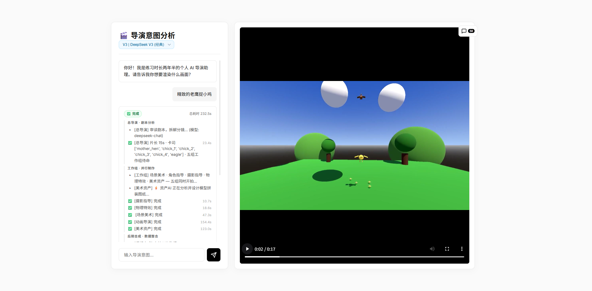

<div align="center">

# 🎬 Virtual Director

**用一句话，生成一段 3D 电影。**

AI 多智能体协作 · Godot 4 实时渲染 · SSE 全链路实时反馈

[](https://python.org)
[](https://fastapi.tiangolo.com)
[](https://react.dev)
[](https://godotengine.org)
[](LICENSE)

</div>

---

## 📸 演示截图



> 左侧：对话式导演意图输入 + 全链路工作流日志实时推送；右侧：Godot 4 渲染输出视频实时预览。

---

## 💡 这是什么？

**Virtual Director** 是一套「**自然语言 → 3D 动画视频**」的端到端生成系统。

你只需输入一句话，例如：

> *"一群小鸡在绿色草地上奔跑，老鹰从空中俯冲而下"*

系统会自动完成：

1. **剧本拆解** — AI 总导演分析意图，输出三幕式叙事结构
2. **并行创作** — 五路专项 AI 组同时工作：场景美术、角色动画、摄影运镜、物理特效、3D 资产
3. **实时渲染** — Godot 4 引擎执行场景，FFmpeg 输出 MP4
4. **成片交付** — 前端直接播放，历史工程随时回溯

---

## ✨ 核心特性

### 🤖 六智能体流水线

| Agent | 职责 |
|---|---|
| **总导演 (Director)** | 三幕式剧本拆解，确定时长、演员 ID、各组任务简报 |
| **场景美术 (Scene)** | 天空颜色、雾效、地面材质、灯光、静态道具布置 |
| **动画导演 (Actor)** | 每个角色的 3D 运动轨迹关键帧（位置、旋转、缩放） |
| **摄影指导 (Camera)** | 电影级运镜：静态凝视 / 跟拍 / 环绕轨道，多模式切换 |
| **物理特效 (Physics)** | 抛物运动、碰撞、滚落等基于物理的动画修正 |
| **资产策划 (Asset)** | 在线检索 3D 模型（Poly Pizza / Sketchfab），失败则 AI 积木拼装 |

### 🧱 Procedural AI Modeling

找不到合适模型时，Asset Agent 会用基础几何体（Box / Sphere / Cylinder / Capsule）**程序化拼装**目标物体，不依赖任何本地模型库。

### 📡 全链路 SSE 实时推送

后端每完成一个阶段立即通过 Server-Sent Events 推送到前端，用户可以看到每一步的进展——从「总导演开会」到「摄影指导完成」再到「渲染第 N 帧」，全程透明。

### 🎥 多模型支持

| 模型 | 用途 |
|---|---|
| DeepSeek-V3 (`deepseek-chat`) | 默认，速度与质量均衡 |
| DeepSeek-R1 (`deepseek-reasoner`) | 复杂场景逻辑推理 |
| DeepSeek-V3-0324 Flash / Pro | 最新旗舰，更强指令遵循 |
| GLM-4.7-Flash | 国产高速备选 |

---

## 🛠️ 技术栈

```
前端            后端              引擎             AI
──────────      ────────────      ───────────      ──────────────────
React 18        FastAPI           Godot 4          DeepSeek V3 / R1
TypeScript      Python 3.11       GDScript         GLM-4.7-Flash
Vite            asyncio + SSE     DirectorEngine   OpenAI SDK
Apple 风格 UI   多 Agent 并发      FFmpeg 合成
```

---

## 📂 目录结构

```
Virtual-Director/
├── backend/
│   ├── agents/             # 六大 AI Agent（director / scene / actor / camera / physics / asset）
│   ├── api/
│   │   └── generate.py     # SSE 流式生成主入口
│   ├── services/
│   │   ├── llm.py          # LLM 调用封装（支持 tool_call + JSON mode + 自动重试）
│   │   ├── renderer_godot.py   # Godot 4 无头渲染
│   │   └── renderer_blender.py # Blender Cycles 渲染（可选）
│   ├── tools/
│   │   └── definitions.py  # 所有 Agent 的 Function Calling Schema
│   ├── config.py           # 路径 & API Key 配置
│   └── main.py             # FastAPI 应用入口
├── frontend/
│   └── src/
│       ├── components/
│       │   ├── ChatPanel.tsx   # 对话 + 工作流日志
│       │   ├── VideoPlayer.tsx # 视频播放 + 渲染进度遮罩
│       │   └── ProjectPanel.tsx # 历史工程库
│       ├── services/api.ts     # SSE 流式请求封装
│       └── App.tsx
├── godot/
│   ├── DirectorEngine.gd   # 核心渲染驱动脚本
│   └── main.tscn           # 主场景
├── projects/               # 历史生成记录（JSON + MP4）
└── yanshi.png              # 演示截图
```

---

## 🚀 快速启动

### 环境依赖

| 依赖 | 版本 | 说明 |
|---|---|---|
| Python | 3.10+ | 后端运行时 |
| Node.js | 18+ | 前端构建 |
| Godot | 4.x | 3D 渲染引擎，需下载独立版 |
| FFmpeg | 任意 | 视频合成，需加入系统 PATH |

### 第一步：克隆仓库

```bash
git clone https://github.com/3361409208a-source/Virtual-Director.git
cd Virtual-Director
```

### 第二步：配置环境变量

在项目根目录创建 `.env` 文件：

```env
DEEPSEEK_API_KEY=your_deepseek_api_key
GLM_API_KEY=your_glm_api_key          # 可选
SKETCHFAB_API_KEY=your_sketchfab_key  # 可选，用于 3D 模型检索
```

### 第三步：配置 Godot 路径

编辑 `backend/config.py`，将 `GODOT_EXECUTABLE` 改为你本机 Godot 4 可执行文件的路径：

```python
GODOT_EXECUTABLE = r"C:\path\to\Godot_v4.x_win64.exe"  # Windows
# GODOT_EXECUTABLE = "/usr/local/bin/godot4"            # Linux/macOS
```

### 第四步：启动后端

```bash
pip install -r requirements.txt
uvicorn backend.main:app --reload
# 后端运行在 http://localhost:8000
```

### 第五步：启动前端

```bash
cd frontend
npm install
npm run dev
# 前端运行在 http://localhost:5173
```

打开浏览器访问 `http://localhost:5173`，在输入框输入任意场景描述，点击发送即可。

---

## 🎮 使用示例

| 输入提示 | 效果 |
|---|---|
| `一群小鸡在草地上追逐，老鹰突然俯冲` | 多角色追逐 + 动态摄像机跟拍 |
| `宇宙飞船从远处飞来，进入大气层` | 宏观场景 + 轨道运动 |
| `两辆赛车在赛道上竞速，观众席人头攒动` | 高速运动 + 物理特效 |

---

## 🔧 进阶配置

- **切换渲染引擎**：`backend/api/generate.py` 顶部 `RENDERER` 变量可在 `"godot"` / `"blender"` 间切换
- **调整帧率**：Godot 渲染默认 24fps，Blender Cycles 默认限制 12fps（CPU 渲染节省时间）
- **模型库扩展**：在 `godot/assets/custom/` 放置 `.glb` 文件，Asset Agent 会优先使用

---

## 📄 License

MIT © [Antigravity](https://github.com/3361409208a-source)
